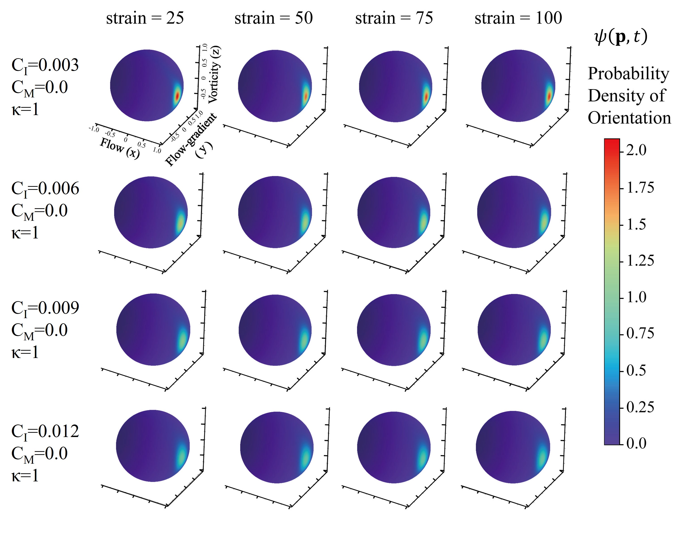
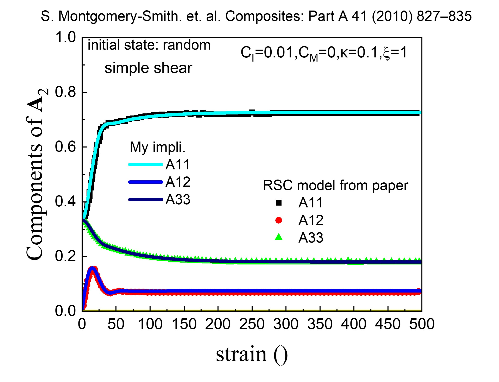
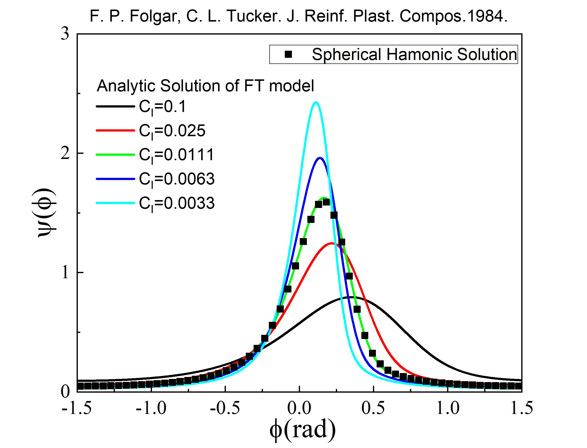
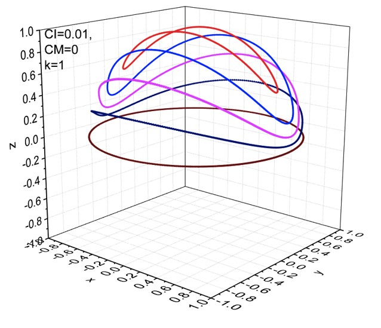
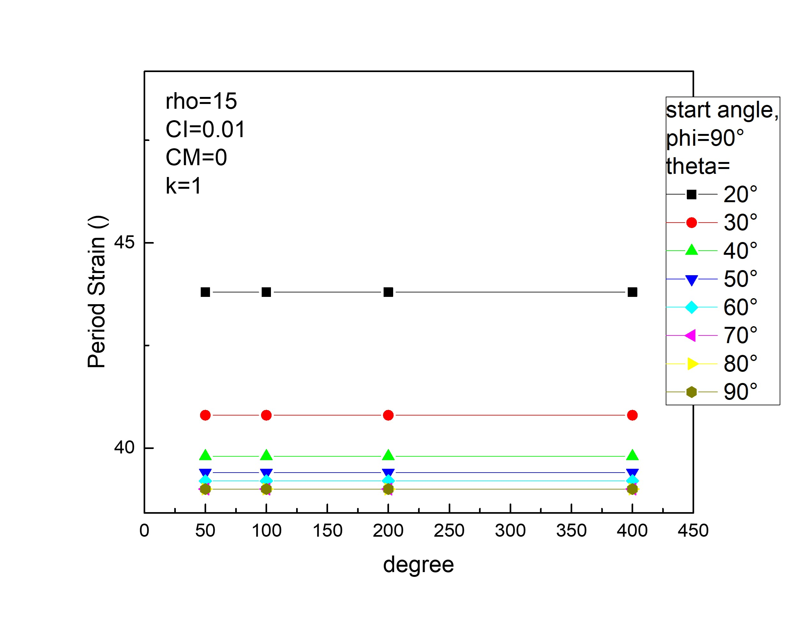

# FiberRheoModels 
Solve the rigid-short-fibers rheology constitutive models by two approaches numerically:  
- **Spherical Harmonics** approach;
- **Object Tensor** approach.
  
**Spherical Harmonic method capable of obtaining the 3D orientation distribution $\psi(\mathbf{p})$ and 3D fiber tumbling trajactories $\mathbf{p}(t)$, while Tensor Method couldn't.**

Author: Dr. Benke Li (李本科)

Author's ORCID: https://orcid.org/0000-0002-8830-0563

Author's ResearchGate: https://www.researchgate.net/profile/Benke-Li

## Dependencies: 
numpy, scipy, pandas, jupyter, matplotlib, pyshtools

## Usage:
1. Make sure that Python3 and the dependencies have been installed. The dependencies could be installed by this command:
   ```
   python3 -m pip3 install numpy scipy pandas jupyter matplotlib pyshtools
   ```
   If there are any problems with system environment configurations, users could run this package in my Docker container:
   ```
   docker run -it -p8888:8888 libenke/base
   ```
3. Download this package directly or run the command in the terminal to download this package:
   ```
   git clone https://github.com/libenke/FiberRheoModels
   ```
5. Run command in your terminal:
   ```
   jupyter-notebook
   ```
   Then open the `.ipynb` files in the jupyter workspace, enjoy it. Usage of jupyter could be found in https://jupyter.org/.
7. The models were solved by: (a) object tensor approach (see examples in `.ipynb` files with the prefix of `Demo_Tensor Method_`), and (b) spherical harmonics approach (see examples in `.ipynb` files with prefix of `Demo_SH Method_`).
8. Background of models and spherical harmonic methods is shown in the following sections.  

## Background 1: Modeling  
Readers are highly recommended to read our published paper ([Benke Li et. al. "Wall effect on the rheology of short-fiber suspensions under shear." *Journal of Rheology* **2021**, 65, 1169-1185.](https://doi.org/10.1122/8.0000292)), all the detail background and references could be found in the introduction section of this paper.

For rigid-short-fibers filled suspensions, their microsopic transient behaviors were mosted interested in two aspects:

1.  Evolution of orientation distributions during flow, denoted as $\dot{\psi}(\mathbf{p})$ or $\frac{\mathrm{d}\psi(\mathbf{p})}{\mathrm{d}t}$. With the definition of the second moment as $\mathbf{A}=\oint\psi(\mathbf{p})\mathbf{pp}\mathrm{d}\mathbf{p}$, the evolution of tensor is denoted as $\mathbf{\dot{A}}$ or $\frac{\mathrm{d}\mathbf{A}}{\mathrm{d}t}$.

2.  Rotation of single fiber during flow, denoted as $\mathbf{\dot{p}}$ or $\frac{\mathrm{d}\mathbf{p}}{\mathrm{d}t}$.

The evolution of the $\dot{\psi}(\mathbf{p})$ can be written as the flux of $\psi$ (orientation probability distribution):  

```math
\begin{equation}\tag{1-1}
\begin{aligned}
\dot{\psi}(\mathbf{p})=-\mathbf{\nabla}_s(\mathbf{\dot p}\psi)
\end{aligned}
\end{equation}
```


>  Here $\mathbf{\nabla}_s$ is the surface gradient operator (Ref: Bird, R. B. et. al. "Dynamics of Polymeric Liquids. Vol. 1: Fluid Mechanics." _Wiley, New York_, **1987**.). It could be written in the following form:  
>  ```math
>  \qquad\mathbf{\nabla}_s=\mathbf{\nabla}-\mathbf{p}(\mathbf{p}\cdot\mathbf{\nabla})=(\mathbf{I}-\mathbf{pp})\cdot\mathbf{\nabla}
>  ```
>  $\mathbf{\nabla}_s$ can also be written as:  
>  ```math
>  \qquad\begin{aligned}
>  \mathbf{\nabla}_s&=\frac{\partial}{\partial\theta}\mathbf{e}_\theta+\frac{1}{\sin\theta}\frac{\partial}{\partial\phi}\mathbf{e}_\phi\\
>  \mathbf{e}_\theta&=(\cos\theta\cos\phi)\mathbf\delta_x+(\cos\theta\sin\phi)\mathbf\delta_y-\sin\theta\,\mathbf\delta_z\\
>  \mathbf{e}_\phi&=-\sin\phi\mathbf\delta_x+\cos\phi\mathbf\delta_y
>  \end{aligned}
>  ```
>  

$\dot{\psi}(\mathbf{p})$, $\mathbf{\dot{A}}$ and $\mathbf{\dot{p}}(t)$ were assumed to be contributed by several terms, written as:  

```math
\begin{equation}\tag{1-2}
\qquad\begin{aligned}
\dot{\psi}(\mathbf{p})&=\dot{\psi}^{HD}+\dot{\psi}^{IRD/iARD}+\dot{\psi}^{RSC} + \dot{\psi}^{Brownian} + \dot{\psi}^{Confined} + ... \\
\\
\mathbf{\dot{A}}&=\mathbf{\dot{A}}^{HD}+\mathbf{\dot{A}}^{IRD/iARD}+\mathbf{\dot{A}}^{RSC} + \mathbf{\dot{A}}^{Brownian} + \mathbf{\dot{A}}^{Confined} + ...\\
\\
\mathbf{\dot{p}}&=\mathbf{\dot{p}}^{HD}+\mathbf{\dot{p}}^{IRD/iARD}+\mathbf{\dot{p}}^{RSC} + \mathbf{\dot{p}}^{Brownian} + \mathbf{\dot{p}}^{Confined} + ... 
\end{aligned}
\end{equation}
```

These terms are summarized as following:  
  
- HD term (hydro dynamic term), also known as Jefferey term. (Ref: Jeffery, G. B., “The motion of ellipsoidal particles immersed in a viscous fluid.” _Proc. R. Soc. London A_ ***1922***, 102, 161–179.) Written as:  
  
```math
\begin{equation}\tag{1-3}
\begin{aligned}
\dot{\psi}^{HD}&=-\mathbf{\nabla}_s\cdot(\mathbf{\dot{p}}^{HD}\psi)\\
\mathbf{\dot{A}}^{HD}&=+\mathbf{W}\cdot\mathbf{A}-\mathbf{A}\cdot\mathbf{W}+\xi(\mathbf{D}\cdot\mathbf{A}+\mathbf A\cdot\mathbf D-2\mathbb{A}_4:\mathbf D) \\
\mathbf{\dot{p}}^{HD} &= +\mathbf{W}\cdot\mathbf{p}+\xi\left(\mathbf{D}\cdot\mathbf{p}-\mathbf{D}:\mathbf{ppp}\right)\\
where \quad \mathbf{D}&=\frac{1}{2}(\mathbf{L}-\mathbf{L}^\mathrm{ T }) \\
and \quad \mathbf{W}&=\frac{1}{2}(\mathbf{L}-\mathbf{L}^\mathrm{ T }) \\
and \quad \mathbf{L}&=\mathbf{\mathit{\nabla v}} \\
and \quad \xi&=\frac{a_r^2-1}{a_r^2+1}
\end{aligned}
\end{equation}
```
  
- IRD term (isotropic diffusion term), also known as FT term. (Ref: Folgar, F., and C. L. Tucker, “Orientation behavior of fibers in concentrated suspensions.” _J. Reinf. Plast. Compos._ **1984**, 3, 98–119.) Written as:  
  
```math
\begin{equation}\tag{1-4}
\begin{aligned}
\dot{\psi}^{IRD}&=+\mathbf{\nabla}_s\cdot(\dot{\gamma}C_I\mathbf{\nabla}_s\psi)\\
\mathbf{\dot{A}}^{IRD}&=+2C_I\dot \gamma(\mathbf I-3\mathbf{A})\\
\mathbf{\dot{p}}^{IRD}&=-C_I|\dot{\gamma}|\frac{\mathbf{\nabla}_s\psi}{\psi}
\end{aligned}
\end{equation}
```
  
- ARD or iARD term (anisotropic diffusion term), introduced for slender fibers with a large aspect ratio. (Refs: Phelps, J. H. et. al. “An anisotropic rotary diffusion model for fiber orientation in short- and long-fiber thermoplastics.” _J. Non-Newtonian Fluid Mech._ **2009**, 156, 165–176. Tseng, H.-C. et. al. “An objective tensor to predict anisotropic fiber orientation in concentrated suspensions.” _J. Rheol._ **2016**, 60, 215–224.) Written as:  
  
```math
\begin{equation}\tag{1-5}
\begin{aligned}
\dot{\psi}^{iARD}&=+\mathbf{\nabla}_s\cdot\left [ \dot\gamma(\mathbf{I}-\mathbf{pp})\cdot\mathbf{D}_r\cdot(\mathbf{I}-\mathbf{pp})\cdot\mathbf{\nabla}_s\psi\right ]\\
\mathbf{\dot{A}}^{iARD}&=+2|\dot{\gamma}|\left(\mathbf{I}-\mathbf{pp}\right)\cdot\mathbf{D}_r\cdot\left(\mathbf{I}-\mathbf{pp}\right)\cdot\left(\mathbf{I}-3\mathbf{A}\right)\\
\mathbf{\dot{p}}^{iARD}&=-|\dot{\gamma}|\frac{\left(\mathbf{I}-\mathbf{pp}\right)\cdot\mathbf{D}_r\cdot\left(\mathbf{I}-\mathbf{pp}\right)\cdot\nabla_s\psi}{\psi}\\
where \quad
\mathbf{D}_r&=C_I\left(\mathbf{I}-C_M\frac{\mathbf{D}^2}{||\mathbf{D}^2||}\right)
\end{aligned}
\end{equation}
```
  
- RSC term (reduced strain closure term), introduced to slow down the evolution of fiber orientation. (Ref: Wang, J. et. al. “An objective model for slow orientation kinetics in concentrated fiber suspensions: Theory and rheological evidence.” _J. Rheol._ **2008**, 52, 1179–1200.) Written as:  
  
```math
\begin{equation}\tag{1-6}
\begin{aligned}
\dot{\psi}^{RSC}&=-\mathbf{\nabla}_s\cdot(\mathbf{q})\\
\mathbf{\dot{A}}^{RSC}&=-(1-\kappa)\sum^3_{i=1}\dot{\lambda}_i^{IRD/iARD}\mathbf{e}_i\mathbf{e}_i\\
\mathbf{\dot{p}}^{RSC}&=-\frac{\mathbf{q}}{\psi} \\
where \quad
\mathbf{q}&=\sum^3_{i=1}\beta_i(\mathbf{e}_i\mathbf{e}_i\cdot\mathbf{p}-\mathbf{e}_i\mathbf{e}_i:\mathbf{ppp})\\
and \quad
\beta_i&=-\frac{5(1-\kappa)}{4\pi}\left[\xi(\lambda_i\mathbf{D}:\mathbf{e}_i\mathbf{e}_i-\mathbf{e}_i\mathbf{e}_i:\mathbb{A}_4:\mathbf{D})+C_I\dot\gamma(1-3\lambda_i)\right]
\end{aligned}
\end{equation}
```
  
- Brownian term. The rotational diffusion coefficient of short-rigid-fiber $D_{r0}$ can be estimated by shish-kebab model, described in the (Eq. 8.16) of the book: Doi, M. and Edwards, S. F. "The theory of polymer dynamics." _Oxford University Press_ **1988**.  Application of this term could see section IX in the supporting information of our previous publication: [Benke Li et. al. "Revealing the Shear Effect on the Interfacial Layer in Polymer Nanocomposites through Nanofiber Reorientation." _Macromolecules_ **2023**, 56, 3050-3063.](https://pubs.acs.org/doi/10.1021/acs.macromol.2c02121)  
  
```math
\begin{equation}\tag{1-7}
\begin{aligned}
\dot{\psi}^{Brownian}&=+\mathbf{\nabla}_s\cdot(D_{r0}\mathbf{\nabla}_s\psi)\\
\mathbf{\dot{A}}^{Brownian}&=+2D_{r0}(\mathbf I-3\mathbf A)\\
\mathbf{\dot{p}}^{Brownian}&=-D_{r0}\frac{\mathbf{\nabla}_s\psi}{\psi}\\
where\quad D_{r0}&=\frac{3k_B T ln(a_r)}{\pi \eta_S L^3}
\end{aligned}
\end{equation}
```
  
- Confined Term (Proposed in our on-going studies. Here $\mathbf{D}^*$ is the confinement induced virtual compression flow, while $\epsilon$ and $\alpha$ is the tunning parameter.
  
```math
\begin{equation}\tag{1-8}
\begin{aligned}
\dot{\psi}^{Confined}&=-\mathbf{\nabla}_s\cdot\left(\mathbf{\dot{p}}^{Confined}\psi\right) \\
\mathbf{\dot{A}}^{Confined}&=+|\dot\gamma|(\mathbf{D^*}\cdot\mathbf{A}+\mathbf A\cdot\mathbf D^*-2\mathbb{A}_4:\mathbf D^*)\\
\mathbf{\dot{p}}^{Confined}&= +|\dot\gamma|\left(\mathbf{D}^*\cdot\mathbf{p}-\mathbf{D}^*:\mathbf{ppp}\right)\\
where \quad \mathbf{D}^*&=\epsilon
                    \begin{pmatrix}
                    \frac{1}{2}+\alpha& 0 & 0\\ 
                    0& -1 &0 \\ 
                    0& 0 &\frac{1}{2}-\alpha 
                    \end{pmatrix}\\
and \quad \alpha&\subseteq[-0.5,0.5]
\end{aligned}
\end{equation}
```
  
## Backgraound 2: Spherical Harmonic Method
  
Ref: Montgomery-Smith, S.et. al. “A systematic approach to obtaining numerical solutions of Jeffery’s type equations using spherical harmonics.” _Compos. Part A_ **2010**, 41, 827–835.  
  
- Expand the orientation distribution function $\psi(t)$ as  spherical harmonics series:

```math
\begin{equation}\tag{2-1}
\psi(t)= \sum_{l=0,-l\lt m\lt l}^{\infty} c_{l,m} (t) Y_l^m (\theta,\phi)
\end{equation}
```

 $\qquad$ Substitute the equation above to equation (1-1), got:  
```math
\begin{equation}\tag{2-2}
\frac{\mathrm{d}c_{l,m}(t)Y_l^m(\theta,\phi)}{\mathrm{d}t}=-\mathbf{\nabla}_s\left[\mathbf{\dot p}c_{l,m}(t)Y_l^m(\theta,\phi)\right]
\end{equation}
```
  
- Expand the above equation (2-2) by **Math Operators** of special function $Y_l^m$  
These operators were defined in the source file: `models/sph_harm_operator.py`
```math
\begin{equation}\tag{2-3}
\begin{aligned}
xY_l^m &\to ziL_y(Y_l^m)-iL_y(zY_l^m) \\
yY_l^m &\to iL_x(zY_l^m)-ziL_x(Y_l^m) \\
zY_l^m &\to \sqrt{\frac{(l+m)(l-m)}{(2l-1)(2l+1)}}Y_{l-1}^m + \sqrt{\frac{(l+m+1)(l-m+1)}{(2l+1)(2l+3)}}Y_{l+1}^m \\
\nabla_xY_l^m &\to ziL_y(Y_l^m)-yiL_z(Y_l^m) \\
\nabla_yY_l^m &\to xiL_z(Y_l^m)-ziL_x(Y_l^m) \\
\nabla_zY_l^m &\to yiL_x(Y_l^m)-xiL_y(Y_l^m) \\
L_x(Y_l^m) &\to \frac{1}{2}\left[L_+(Y_l^m)+L_-(Y_l^m)\right] \\
L_y(Y_l^m) &\to -\frac{i}{2}\left[L_+(Y_l^m)-L_-(Y_l^m)\right] \\
L_z(Y_l^m) &\to -mY_l^m \\
L_+(Y_l^m) &\to -\sqrt{(l+m)(l-m+1)}Y_l^{m-1} \\
L_-(Y_l^m) &\to -\sqrt{(l-m)(l+m+1)}Y_l^{m+1} \\
\ \\
\mathrm{Plus\ extra\ relations:} \\
\nabla_s^2Y_l^m &= L^2Y_l^m = l(l+1)Y_l^m \\
\mathbf{r}\cdot\nabla_sf &= \mathbf{r}\cdot\mathbf{L}f = \mathbf{L}\cdot (\mathbf{r}f)=0 \\
\nabla_s(\mathbf{r}f)&=2f
\end{aligned}
\end{equation}
```
  
- Obtain orientation tensor $\mathbf{A}(t)$ from the spherical harmonic expansion coeficients $c_{l,m}(t)$:
```math
\begin{equation}\tag{2-4}
\mathbf{A}  = \iint \mathbf{pp} \psi \mathrm{d}s = \iint \begin{pmatrix}
 x^2 & xy &xz \\
 xy & y^2 &yz \\
 xz & yz &z^2
\end{pmatrix} \psi \mathrm{d}s
\end{equation}
```
 $\qquad$  Here $\mathrm{d}s$ is the spherical surface unit, and $\mathrm{d}s=\sin\theta \mathrm{d}\theta \mathrm{d}\phi$.For $Y_l^m$ functions, the spherical surface integration results $\iint Y_l^m \mathrm{d}s$ is always zero except $\iint Y_0^0 \mathrm{d}s$. And:  
```math
\begin{equation}\tag{2-5}
\iint  c_{0,0}Y_0^0 \mathrm{d}s = 2\sqrt{\pi}c_{0,0}
\end{equation}
```
 $\qquad$ Here the coeficient $2\sqrt{\pi}$ depends on the normalization method during spherical harmonic calculations. Substitute the equation (2-1) and (2-3) to equation (2-4), with applying **Mathematica**, details see the source file `Sph_Harm_Operators.nb`, we got:  
```math
\begin{equation} \tag{2-6}
\begin{aligned}
\iint x^2 \psi \mathrm{d}s &=2\sqrt{\pi}\left(\frac{c_{0,0}}{3}+\frac{c_{2,-2}}{\sqrt{30}}-\frac{c_{2,0}}{3\sqrt{5}}+\frac{c_{2,2}}{\sqrt{30}}\right) \\
\iint xy \psi \mathrm{d}s &= 2\sqrt{\pi}\left(\frac{ic_{2,-2}}{\sqrt{30}}-\frac{ic_{2,2}}{\sqrt{30}}\right)\\
\iint xz \psi \mathrm{d}s &= 2\sqrt{\pi}\left(\frac{c_{2,-1}}{\sqrt{30}}-\frac{c_{2,1}}{\sqrt{30}}\right)\\
\iint y^2 \psi \mathrm{d}s &=2\sqrt{\pi}\left(\frac{c_{0,0}}{3}-\frac{c_{2,-2}}{\sqrt{30}}-\frac{c_{2,0}}{3\sqrt{5}}-\frac{c_{2,2}}{\sqrt{30}}\right) \\
\iint yz \psi \mathrm{d}s &= 2\sqrt{\pi}\left(\frac{ic_{2,-1}}{\sqrt{30}}+\frac{c_{2,1}}{\sqrt{30}}\right) \\
\iint xy \psi \mathrm{d}s &= 2\sqrt{\pi}\left(\frac{c_{0,0}}{3}+\frac{2c_{2,0}}{3\sqrt{5}}\right)\\
\end{aligned}
\end{equation}
```
## Calculation Results:  
- Fiber orientation distribution $\psi(\mathbf{p},t)$, with the $Y_l^m$ expansion degree choosing 100.  
  
  
  
- Evolution of orientation tensor $\mathbf{A}(t)$. Comparison with the paper's results. The $Y_l^m$ expansion degree here is 100.  
  
  
  
- Orientation distribution in the gradient-flow plane, i.e. $\psi(\phi)$. The $\theta$ axis were elimited by numeric integration:
```math
\begin{equation}\tag{3-1}
\psi(\phi) = \int_0^\pi \psi(\mathbf{p}) \sin\theta \mathrm{d}\theta
\end{equation}
```
 $\qquad$ Practically, this integration was applied the Guass-Legendre quadrature method.  
 $\qquad$ Comparison of the spherical harmonic methods' results with the analytic solution of IRD model (or FT model), here the $Y_l^m$ expansion degree here is 100:  
  
  
  
- Fiber tumbling trajectory $\mathbf{p}(t)$， with parameter of $C_I=0.01,C_M=0,\kappa=1,\xi=1$, and $Y_l^m$ expansion degree is 100.  
  
  
  
- Influence of $Y_l^m$ expansion degree to the tumbling period. It seems that expansion degree of 50 could provide enough calculation precision.  
  
  
  
